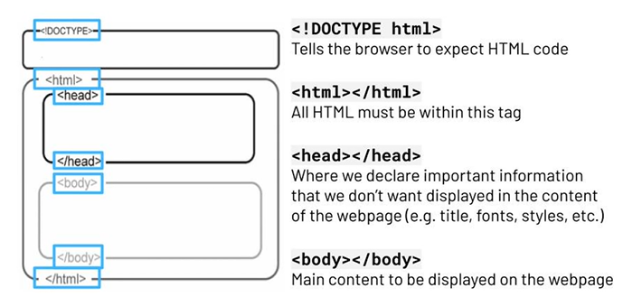

# javascript

# Variables

Use let to declare a variable that can be changed throughout the program.
Use const to declare a variable that cannot be changed.

# Arithmetic operations
We can perform a number of arithmetic operations on numbers in
JavaScript:
•
Addition
Subtraction
Multiplication
Division
Modulus (remainder)
Increment and Decrement

Interpolation can be recognised by the backticks and the $ sign, followed by the variable name in curly brackets { }
The output is the same as when we used concatenation

# Undefined and Null
- undefined means that a variable hasn't been assigned a value.
- null is a special value that means 'nothing'.
Sometimes a variable doesn't have a value because it hasn't been
assigned:

let message; // Value is undefined

Sometimes you want to say that a variable doesn't have a value:
let message = null

# Basic programming constructs
Programs are made using basic programming constructs. These are the building blocks that form the basis of all programs.
There are three basic building blocks to consider:
- Sequence 
  Sequence is when a set of instructions follow on from one another.
  It is the order in which instructions occur and are processed.
- Selection
  Selection is a decision that is made within a program, based on an event.
  Selection allows for decision making and executing different parts Of code, based on those decisions.
- Iteration
  Iteration is the repetition of a block of code when the program is running.

  There are times when a program needs to repeat a block of code.
  These are often referred to as 'loops'.
  This enables code to be simplified. As a programmer, you would write the code once and ask the program to execute it multiple times.

  # Comparision operators

  - A comparison operator is a symbol or set of symbols that can be used in programming to compare two values or expressions. 
  - It returns a Boolean result (true or false).
  - Similar to Booleans, comparison operators are very important in controlling the flow of a program.
  - Comparison operators can also be used to filter data.
  - For example, only wanting to display numbers that are even (or divisible by two).
  - They can also be used to sort and order data

  # Boolean Operator
  - A Boolean data type is used when the value can only be true or false.
  - Booleans are used to represent states or conditions that can either be true or false.
  - They are fundamental in logical operations and control flow in programming.
  - Booleans are important for decision making in programming.

  # Operand
  An operand is the value on which an operator acts (name and " Sue" , or "123" and " 123").

- Operator Equal to Equal (==)
This operator returns true' if the values (not type) of the two operands are equal
Example
5=="5" / / true

- This operator returns true' if the values and data type of the two operands  are equal
Example
"123"=== "123" / true

- Not equal to (!=)
This operator returns 'true' if the values of the two operands are not equal.
It does not take into account the data type.
Example
5!="5"    / / false

- NOt equal to (value and type)(!==)
This operator returns 'true' if the values or data type of the two operands are not equal.
Example
"123"!=="123"
/ / false

and other operators are <, >, <=,>= 

# Logical Operators

- A logical operator is one of a set of keywords that connect two or more expressions or conditions.
- It returns a Boolean result.
- Logical operators are important in controlling the flow of a program.
- Logical operators mean that you can combine conditions and comparison operators to have more complex decision making.
- EXAMPLE
I only want to go outside if it is sunny and it is warm.

- AND (&&)
This operator returns 'true' if both operands are true.
Example: isSunny && isWarm
- OR (||)
This operator returns true' if at least one operand is true.
Example: isSunny || isWarm
- NOT (!)
This is used to negate the value of a Boolean expression.
Example: ! isSunny

# Loops

- Loops are used to repeat a set of instructions.
- Iteration is the repeated execution of a section of code whilst a program is
running. A loop will iterate until a certain condition is met.

It is called 'looping' because the program 'loops' back to an earlier line
of code.
Repetitive tasks are very common in programming.
Loops save time and minimise errors.

# There are two types of loops in programming:
1. Count-controlled loops - repeats code a certain number of times
o E.g. for loops

# FOR LOOP

- A for loop repeats a block of code for a specified number of iterations.
- Sometimes we want to repeat a block of code.
- We might want to do something IO times or 42 times.
- It's often useful to have a loop counter variable that tells us which repetition of the loop we are on.
- A for loop is best used for iterating over elements in an array

2. Condition-controlled loops - repeats code for as long as a certain
condition is true
o E.g. while loops
# WHILE LOOP

- A while loop repeats a block of code while a condition is true.
- They are also used when we want to repeat an action.
- We might not know how many times we need a loop to run, so we cant use a for loop.
- While loops will repeat until a condition is met.

# INFINITE LOOP
- Infinite loops are coding structures that continuously execute a block of code due to a missing or incorrect condition.
- They can cause a program to crash!
- Make sure to always change the loop variable inside Of the loop, otherwise it may run forever!
- It could freeze your computer!
- This is a bug called an infinite loop.

# FUNCTIONS
- Functions allow programmers to organise a section of code and give it a name related to what it does. 
- Functions are a reusable block of code designed to perform a specific task.

We are working on a huge program, with thousands Of
lines of code. Instead of repeating the same tasks over
and over again, we can:
EXAMPLE
1. We can write the code once, in a function.
2. We can then call the function to get that code to run.

We can write our own functions, but JavaScript also provides some built in  ones!
EXAMPLES: 
- console. log( )-log( ) is a predefined function that lets us output something to the console
- array. push( ) - push( ) is a predefined function that lets us add an item to an array.
