# What is web developement
- Web development is the process Of creating websites or web applications
  that are accessible via the internet.
- A web page is simply a document that can be displayed by a browser.
- A website is a group of web pages connected together.

# There are three basic technologies which work together, like building blocks, to make up the web.
1. HTML
2. CSS
3. JS

# HTML
- HTML (Hyper Text Markup Language) is used to create the structure of a web page. 
- It's the actual elements and structure on the page.
- E.g. Text, links, buttons, and images.

# CSS
- CSS (Cascading Style Sheets) is a sheet language used to define the presentation, layout and design of web pages.
- It can be used for changing colour, fonts and the sizes of elements on the page.

# JAVASCRIPT
- JavaScript (JS) is a programming language used to add interactivity and dynamic behaviour to web pages.
- This is how our websites start to turn into interactive and dynamic web applications.

There are lots of other languages, frameworks, technologies and tools we can use in addition to HTML, CSS and JavaScript to build web applications.

***We create separate files to store our HTML, CSS and JavaScript code in.***
***From our HTML file, we link our CSS and JavaScript files.***

**BASICS ABOUT HTML**

* An HTML tag is a code element that is used to define the structure andcontent of a webpage. 
* HTML tags are enclosed in angle brackets < > and usually come in pairs: an opening tag and a closing tag.
* An HTML page consists of a series of tags.
* These can be nested inside of each other.
* There are some important tags we always need to Start with

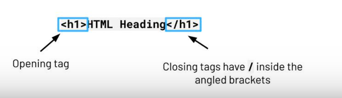
# Same with h2, h3, h4,h5 and h6

* PARAGRAPH TAG

- Used for most text on a webpage

* DIVIDER TAG <div»
- Used to break up segments on a webpage

* UNORDERED LIST<ul>
- Used to create bullet point lists

* ORDERED LIST<ol>
- Used to create numbered lists

* IMAGE TAG 
- Used for adding images to a web page.

* LINK TAG <link>
- Used for linking CSS stylesheets.

* HORIZONTAL LINE BREAK

- Used to break up the page when the content changes

# IDs AND CLASSES

- We use IDs and classes to name different HTML elements. 
- They are used to apply styles to specific elements.
- Class names can be reused, IDs should be unique and only used on one element.

<hl id="main—heading ">My Main Heading</hl>

Paragraph 1

Paragraph 2

Paragraph 3

## THE DOM - Document Object Model
- When a web page is loaded, the browser creates a Document Object Model (DOM) of the page. 
- The DOM provides JavaScript methods to read and write webpage content.

The DOM:
* Is standard for how to get, change, add, or remove HTML elements.
* Breaks down the structure of an HTML page into a 'tree structure'.
* In the DOM, HTML elements are represented as objects.

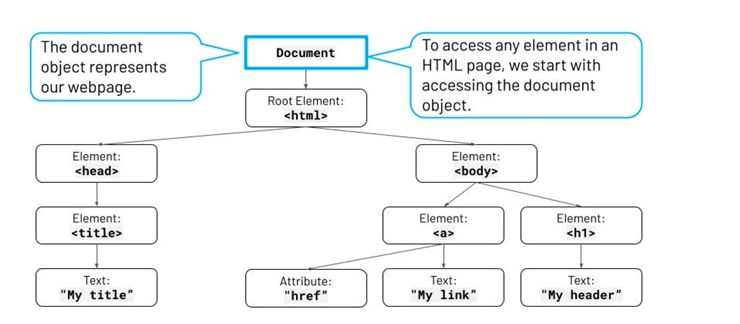

**To link our JavaScript code to an HTML page, we need to add a  HTML tag.**

- It is best practice to do this just before the closing tag.
- Adding it at the end of the </body >means that the website is loaded first, before any JavaScript is run.

* 
* The src should link to the name of the JavaScript file

# Creating a new HTML Element
**To create a new HTML element, we use the document .createElement method.**

- This method creates an element but doesn't add it to the page yet.
- Syntax: document .createE1ement ("tagName")

# Storing s new element
**After creating a new element, we need to store it in a variable.** 

- This allows for easy interaction with the element, and improves readability and reusability in the code.
- Syntax: const newDiv=document.newElement("div");

Now we can edit our new element, before we add it to the document and display it on our webpage.

newDiv .textContent="Hello, World!";

<!-- Now we are ready to add the new element to our HTML page! We do this by appending (adding) the new element to an existing element.  -->

# This specifies where in the document the new element should be placed.

  document. body.appendChi1d(newDiv) ;
  Access the body element of our page and Append (add) the new element

# To remove an element, we first need to find the element in our HTML that we want to remove. 

We can do this by using getE1ementById ( ).
const elementToRemove = document.getElementByID("elementId")

# Once we have got the element to remove, use . remove( ) to remove it.
elementToRemove.remove();

There are a few others ways we can find an element to remove as well as getElementById():

- getE1ementsByClassName ( )
Will find all HTML elements with the specified class name

- getE1ementsByTagName ( )
Will find all HTML elements of this tag type

To modify existing HTML elements, let's put together what we have learnt so far.
First, we find the element:
- getEIementById ( )

Then, we can modify it:
-  E.g. textContent
- There are lots of ways we can modify HTML. Let's look at some more examples.

# CSS

1. What is CSS?
- CSS (Cascading Style Sheets) are used to style a page.
For example, changing the colour, fonts and size of elements on a page.

2. How do we link HTML and CSS files?
- 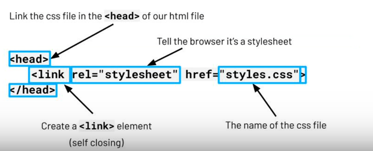
3. What is the structure of CSS (selectors, properties and values)?
- CSS structure comprises of:
  * Selectors - CSS selectors tell the browser which HTML element to apply the styling to.
  * Properties- CSS properties define the particular styles and attributes of the HTML elements that we would like to change. Some examples are color,font-size, and margin.
  * Values- CSS values are a specific setting applied to the CSS properties. For example the actual colour that the property holds
  * Declarations- CSS declarations are a single line within CSS that consist of both a property and a value.

  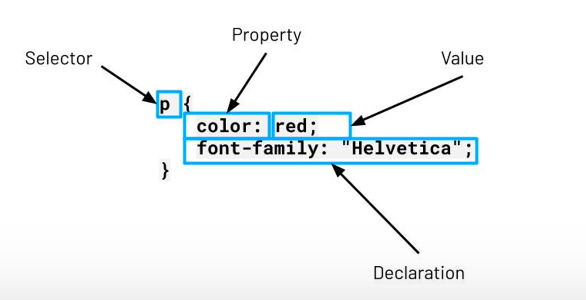
4. What are common CSS properties?
- color
• Specifies the colour of text
- background-color
• Specifies the background colour Of an element
- height
• Sets the height of an element
- width
• Sets the width of an element
- font-size
• Specifies the font size Of text in pixels, e.g. 20px is 20 pixels
- margin
• Specifies the top, left, bottom, and right margins of an element
- display
• Specifies how a certain HTML element should be displayed

5. How can I change multiple properties?
- We can change multiple properties in the same block of code for a specific
selector.
- When we want to move on to styling the next element, we simply start a
new selector underneath.

# Styling Websites
1. Why do we style websites with CSS and JavaScript?
- Interacting with a web page's styling (CSS), using JavaScript, allows us to make interactive websites that can change their style, based on  certain events.
2. How do we use  .style?
- We can use the property . style to select and modify the CSS rules of a selected element.
* First, we find the element we want to style and store it in a variable,just like we did for HTML elements:
=let elementToSty1e - document . getElementById( " id" ) ;
Then we use style. property to select the CSS property we want
to change:
elementToSty1e.style.property = "...";
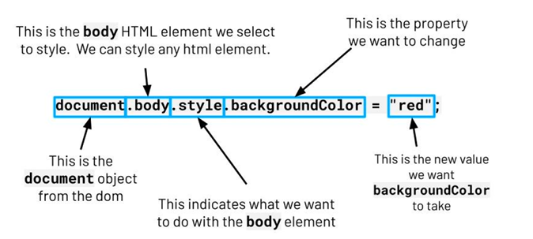
3. How do we style properties in VS Code?
- VS Code helps us view all the properties that are available for us to edit.

1. What are events?
Events allow you to run code when something happens, such as a click on a
button.

* We don't always want our code to run when the web page loads
* Sometimes we want code to run when something happens, such as the user clicking a button or changing a value

Some examples of events include:
Click
Mouse hover
Pressing a key on the keyboard
Submitting an HTML form
Page load

2. What are inline events?
- Inline events are events that are directly specified in the HTML element tag.
A JavaScript function is called directly in the HTML tag.
3. How do we handle inline events in HTML?
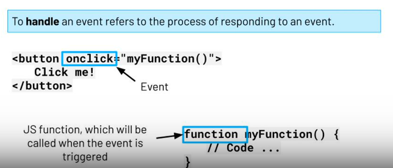
4. What are event listeners?
Event listeners are functions that are attached to HTML elements through
JavaScript. These functions are a method of handling events. They 'listen
out' for events, such as a click of a button, and are written directly in the
JavaScript code.
This is done through functions, such as . addEventListener( )
Event handling code is written separately in JavaScript, keeping HTML and
JavaScript distinct.
5. How do we use event listeners?
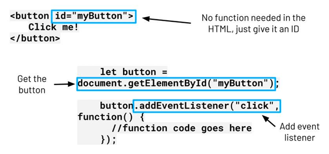
6. What are the benefits of event listeners vs inline events?
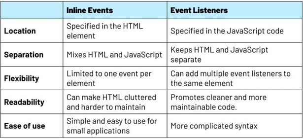

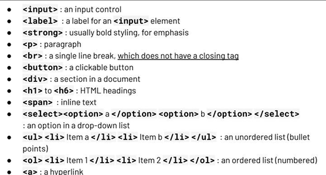, 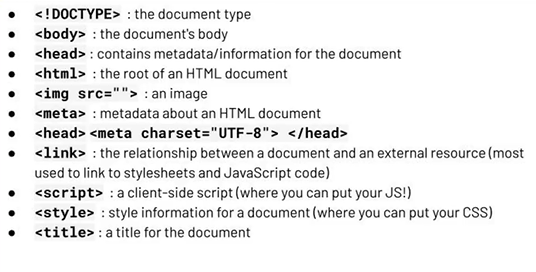
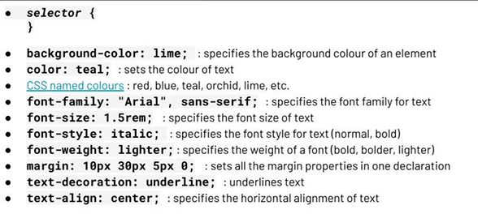